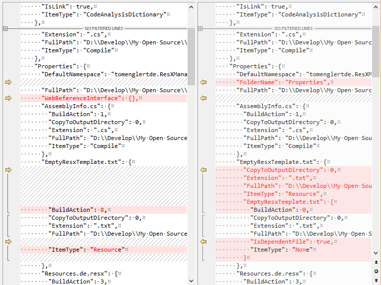

## Project Migration Helper

Whether you migrate your projects manually or using e.g. 
the [CsprojToVs2017 Converter](https://github.com/hvanbakel/CsprojToVs2017) - the new 
sdk style format has so many implicit defaults that you can never be sure that the migrated project 
does exactly the same as the original one. 
An unnoticed switch of an ```ItemType``` or ```BuildAction``` can easily make the project 
fail at runtime due to missing resources or content.

This Visual Studio extension helps you to validate the migration of old style projects to the new VS2017+ sdk format.
It creates a simple Json style fingerprint of all projects in your solution.

You can find the Project Migration Helper in the tools menu of Visual Studio.

Create a fingerprint before and after the migration, then compare the fingerprints to ensure there are no semantic differences:


